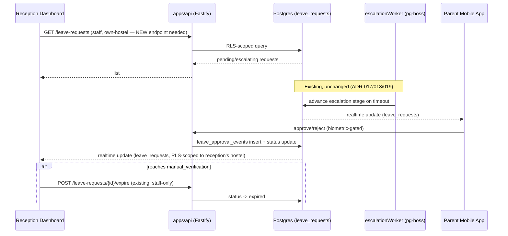
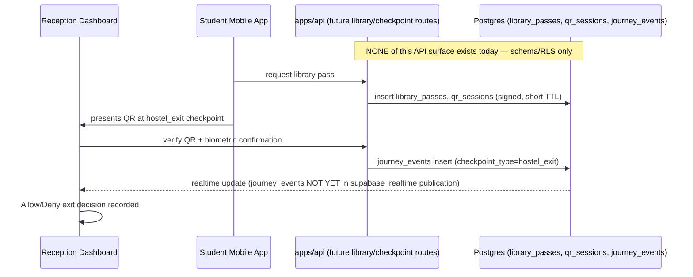
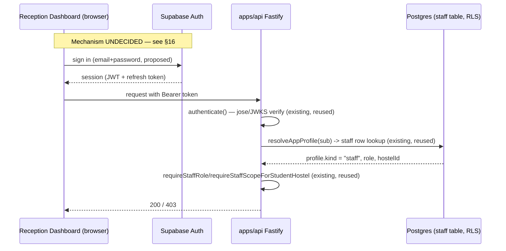
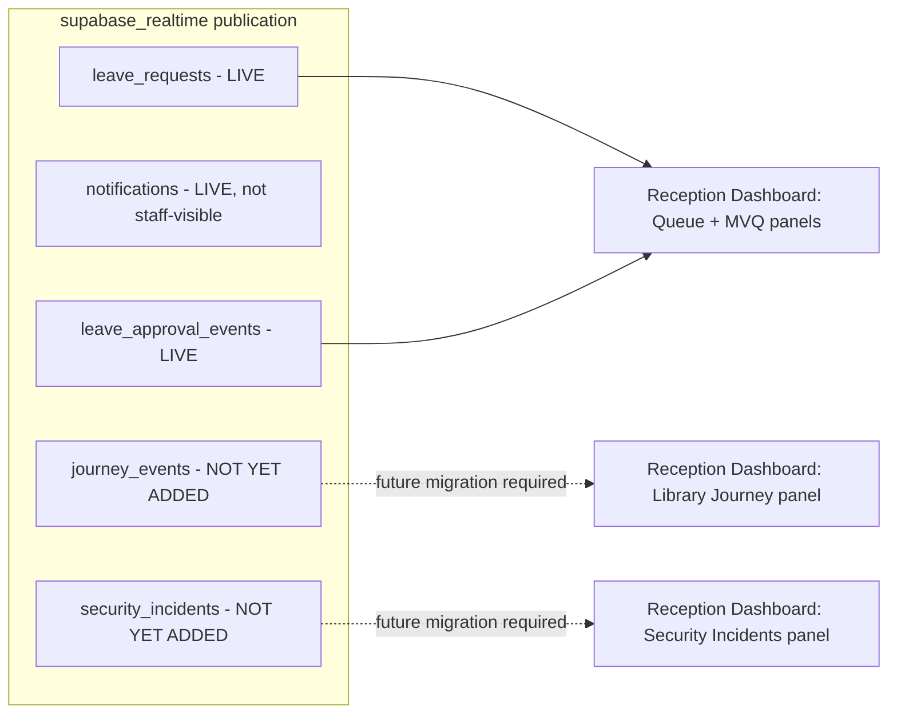
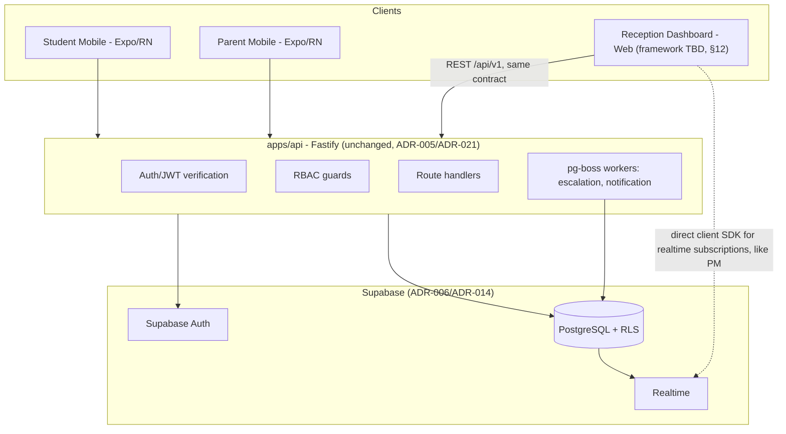

# Reception Dashboard — Architecture Planning Document

**Status: PLANNING ONLY.** No application code, migrations, dependencies, or configuration were created or modified in producing this document (Phase 0 — Prompt 0.1). Everything below is either **VERIFIED** against the current repository, **INFERRED** from verified evidence, **UNVERIFIED**, or explicitly marked **REQUIRES DECISION**. Nothing here is invented beyond what the SDD, accepted ADRs, and the existing implementation support. This document is the architectural source of truth for Prompt 0.2 (scaffolding) and later Reception Dashboard implementation phases.

---

## 1. Executive Summary

The Reception Dashboard is the sixth of six SDD-defined client surfaces (SDD Ch.3) and the third planned `apps/*` package (after `apps/api`, `apps/student-mobile`/`apps/parent-mobile`). It is a **web application** — not mobile — serving three of DigiHostel's seven roles: **Reception Warden**, **Hostel Administrator**, **Super Administrator** (SDD Ch.7 §7.5; ADR-001). It does not serve Library In-charge (that role has its own, separately-planned Library Dashboard — SDD Ch.8, `docs/workspace-structure.md`).

Two facts dominate this plan:

1. **No dedicated ADR exists for the web framework.** `docs/workspace-structure.md` and `docs/target-architecture.md` both explicitly defer this choice. §12 below proposes one (draft ADR-023) but does not accept it — acceptance is a project-governance action outside this planning-only prompt's scope (`docs/adr/README.md`).
2. **Backend readiness is uneven across the Reception Dashboard's own module list.** The Parent Leave Approval backend (leave requests, escalation, staff-only expire) is fully implemented and directly reusable. The Digital Library Pass backend (Ch.6 — library passes, QR sessions, journey events) and the Security Incident backend (emergency/health alerts) have **database tables and RLS policies already migrated, but zero Fastify route surface** (`docs/current-state.md`, confirmed independently in §14 below). This means the Reception Dashboard's own implementation roadmap has a real, evidence-based sequencing dependency, not just an aesthetic one — see §33.

## 2. Reception Dashboard Vision

Per SDD Ch.7 §7.1 (source text extracted from `sdd/Chapter_7_Reception_Dashboard_SDD.docx`):

> "Provide a centralized operational dashboard for hostel reception to manage student exits, parent approvals, library journeys and manual verification."

SDD Ch.7 §7.3 workflow (verbatim):

> Student arrives → Search by Roll Number → View leave/library status → Trigger parent approval if required → Monitor realtime progress → Allow/Deny exit → Record audit.

SDD Ch.7 §7.4 (Live Panels): Pending approvals, Active library journeys, Overdue journeys, Security incidents, Sync status.

SDD Ch.7 §7.5 (Role Permissions, verbatim table): Reception Warden → "Approve workflows, monitor queue"; Hostel Admin → "Reports & configuration"; Super Admin → "Full access". **Library In-charge is not listed for this module** — consistent with ADR-001's separate-dashboard-per-actor-category principle.

## 3. Source/Repository Inspection Summary

Inspected for this plan (all VERIFIED by direct read, not assumed):

- `CLAUDE.md`, `workflow.md`, all `docs/*.md` referenced by `CLAUDE.md`, `.claude/rules/*.md`
- `sdd/Chapter_7_Reception_Dashboard_SDD.docx` (extracted directly — no prior markdown transcription existed), `sdd/Chapter_13_API_Design_and_Integration_Layer_SDD.docx`
- `docs/adr/ADR-001` (client application architecture), `docs/adr/README.md` (registry, lifecycle), `docs/workspace-structure.md`, `docs/target-architecture.md`, `docs/architecture-requirements.md`, `docs/technology-decision-matrix.md`, `docs/rls-policy-matrix.md`, `docs/current-state.md`
- `packages/db/src/schema/*.ts` (all 9 files — enums, hostel, identity, leave, library, audit, notification, device, rls-helpers) — full schema and RLS policy bodies, not summaries
- `apps/api/src/lib/auth/guards.ts` (full file), `apps/api/src/routes/auth.ts`, `apps/api/src/routes/` and `apps/api/src/domain/` directory listings
- `apps/parent-mobile/src/` top-level structure, `packages/api-client-react/package.json`, `supabase/migrations/*.sql` (realtime publication membership)

Not inspected (genuinely out of scope for this planning pass, not overlooked): full `apps/parent-mobile` component/UI source, `apps/api` test files, Supabase project dashboard/live data (no live Supabase instance was queried — all conclusions are from migrated schema files).

## 4. Existing Architecture Reuse Analysis

| Asset | Reusable as-is? | Basis |
|---|---|---|
| `@digihostel/api-client-react` (generated React Query hooks) | **Yes, directly.** Peer-deps only on `react@^19`, no React Native dependency (`packages/api-client-react/package.json`). | VERIFIED |
| `@digihostel/api-zod` (generated Zod schemas) | **Yes, directly.** Framework-agnostic. | VERIFIED |
| `@digihostel/db` (Drizzle schema, RLS policies) | **Yes, directly** — the dashboard talks to the same Fastify API and, for realtime, the same Supabase project. No new schema package needed. | VERIFIED |
| Fastify RBAC guards (`requireStaffRole`, `requireReception`, `requireHostelAdmin`, `requireSuperAdmin`, `requireStaffScopeForStudentHostel`) | **Yes, directly** — already staff-role- and hostel-scope-aware, already exercised by the staff-only `/leave-requests/{id}/expire` route. | VERIFIED (`apps/api/src/lib/auth/guards.ts`) |
| RLS policies for `leave_requests`, `leave_approval_events` (reception/hostel_admin/super_admin clauses) | **Yes, directly** — already migrated and pgTAP-tested. | VERIFIED (`packages/db/src/schema/leave.ts`, `docs/rls-policy-matrix.md`) |
| RLS policies for `library_passes`, `qr_sessions`, `journey_events`, `security_incidents`, `rooms`, `hostels`, `student_room_assignments` (reception/hostel_admin/super_admin clauses) | **Schema/RLS yes; API no.** Tables and policies exist and are migrated; **no Fastify route reads or writes any of them** (confirmed: `apps/api/src/routes/` has only `auth.ts`, `devices.ts`, `health.ts`, `leave.ts`). | VERIFIED |
| `pino` structured logging, tiered rate limiting, global error handler | **Yes, directly** — backend-side, no dashboard-specific work needed beyond adding a rate-limit tier if a new sensitive route needs one. | VERIFIED (`docs/current-state.md` F-01/G-01/G-02 entries) |
| Supabase Realtime (Postgres Changes) | **Partially.** `leave_requests`, `notifications`, `leave_approval_events` are realtime-enabled (`supabase/migrations/0002_realtime_publication.sql`, `0007_f08_...sql`). `journey_events`, `security_incidents`, `library_passes`, `qr_sessions` are **not** in the `supabase_realtime` publication yet — a new migration is required before any of those can drive a live panel (Ch.7 §7.4's "Active library journeys," "Security incidents" panels). | VERIFIED |
| Parent Mobile's realtime-hook pattern (`useLeaveRequestRealtime`, invalidate-then-refetch via TanStack Query, not direct cache merge) | **Pattern reusable, code is not** (RN-specific `AppState`/NetInfo wiring won't port, but the invalidate-on-change approach is framework-agnostic and should be repeated). | VERIFIED pattern exists (`apps/parent-mobile/src/hooks/useLeaveRequestRealtime.ts`), INFERRED reusability of the pattern itself |
| `notifications` table as a staff-facing notification source | **No.** `notificationRecipientType` enum is `["parent", "student"]` only; RLS grants staff **zero** access to `notifications` (`rls-policy-matrix.md`'s `notifications` section: "staff (any role) ❌ — not staff-facing data"). Reception's "Notification Center" (Ch.7 §7.2) must be built as **live dashboard panels over operational tables**, not as a consumer of the existing notification pipeline. Extending the enum with a `staff` value is a Future/REQUIRES DECISION schema change (§19). | VERIFIED |
| CORS (`origin: false`) | **No — must change.** `apps/api`'s CORS is currently locked down because "no browser-based client exists for this API" (`docs/current-state.md`, Prompt 12 RC1). The Reception Dashboard is exactly such a client; this is a required, flagged Phase 1 backend change (not made by this planning pass). | VERIFIED |
| Staff authentication (login) | **Route/UI does not exist.** `apps/api/src/routes/auth.ts` implements only the parent roll-number→OTP flow (ADR-020, F-02). There is no staff login route or screen. The authorization layer (`resolveAppProfile`, `guards.ts`) already understands a `staff` profile kind once a session exists, but nothing issues that session today. **Mechanism RESOLVED — ADR-024 (password + native TOTP MFA, ACCEPTED); the actual login/MFA UI and any backend login route remain Phase 1 work, not built by either scaffolding pass — see §16.** | VERIFIED |

## 5. Functional Scope — Modules (SDD Ch.7 §7.2, mapped to MVP/Required/Future)

| # | Module (SDD Ch.7 §7.2 name in **bold**) | MVP / Required Now | Future | Backend dependency status |
|---|---|---|---|---|
| 1 | Authentication | Required Now | | Staff login flow — **does not exist** (§16, REQUIRES DECISION) |
| 2 | Role-Based Access Control | Required Now | | Fastify guards exist and are reusable; RLS exists (§4) |
| 3 | Dashboard Home | Required Now | | Composes data from modules below |
| 4 | **Parent Leave Approval** (Leave Request Queue / Approval Session Monitoring) | Required Now | | **Fully backend-ready** — `GET /leave-requests` (staff-scoped listing does not exist yet as a distinct endpoint — see §13), `GET /leave-requests/{id}`, `GET /leave-requests/{id}/events`, `POST /leave-requests/{id}/expire` all exist (`docs/api-contract.md`) |
| 5 | **Manual Verification Queue** | Required Now | | Backed by existing `manual_verification` status + `/expire` route; no dedicated "list all manual_verification requests for my hostel" endpoint exists yet — new, narrow endpoint needed (§13) |
| 6 | Notification Center | Required Now (as live panels, not the `notifications` table) | Staff-targeted push/toast notifications | See §4 row on `notifications` table |
| 7 | Student Search / Student Profile | Required Now | | `students` table + RLS exist (reception: own-hostel SELECT); **no search/list endpoint exists** — new endpoint needed |
| 8 | **Library Journey Monitor** / Student Movement (check-in/out) | | **Future — blocked** | `library_passes`/`qr_sessions`/`journey_events` tables + RLS exist; **zero Fastify route surface** (Ch.6 Digital Library Pass backend is unbuilt — a separate MVP module per `docs/product.md`, not Reception-Dashboard-owned work) |
| 9 | Emergency Management / Health Alerts | | **Future — blocked** | `security_incidents` table + RLS exist; **zero Fastify route surface** |
| 10 | **Audit Logs** | Required Now (read surface) | | `audit_logs` table has **no client-facing RLS at all by design** — a dedicated staff-authorized Fastify endpoint is required (matches `docs/api-contract.md`'s listed-but-unbuilt `/api/v1/audit` family) |
| 11 | **Reports** / Analytics | | Future | No aggregation endpoints exist; no SDD-specified report definitions found beyond the Ch.7 module name itself |
| 12 | User Management (staff provisioning) | Required Now (super_admin only) | | `staff` table + RLS exist (`staff_all_super_admin`); no provisioning endpoint exists yet |
| 13 | Hostel Configuration | Future | | `hostels`/`rooms` RLS exist; low-priority per Ch.7 (bundled under "Hostel Admin: Reports & configuration") |
| 14 | Profile & Settings, Help & Support, System Health/Monitoring | Future | | No SDD detail beyond names; not Reception-Dashboard-differentiating work |

**"Head Warden" role** — this planning prompt's §9 asks to evaluate a Head Warden role. **No basis for it exists anywhere in the repository**: `staff_role` enum (`packages/db/src/schema/enums.ts`) has exactly four values (`reception_warden`, `library_incharge`, `hostel_admin`, `super_admin`); SDD Ch.7 §7.5's role table lists only Reception Warden, Hostel Admin, Super Admin; `docs/product.md`'s canonical seven-role list has no such role. **Marked UNVERIFIED / REQUIRES DECISION** — not assumed, not designed around, per this document's evidence-only mandate. If a real operational need for an intermediate role emerges, it requires a new ADR (new enum value, new RLS policies, new migration) before implementation, per `docs/adr/README.md`'s supersession/ambiguity-resolution process.

## 6. Non-Functional Requirements

Sourced from `docs/architecture-requirements.md` (already the canonical, cited consolidation of SDD Ch.17/Ch.18 — not re-derived here):

- Security: Zero Trust, Least Privilege, Defense in Depth, Secure by Default, Fail Securely, Continuous Monitoring (SDD Ch.17.1).
- Performance budgets: <500ms API, 99.9% uptime, <2s realtime latency (SDD Ch.18).
- Realtime without polling, via Supabase Realtime specifically (SDD Ch.3/Ch.13 §13.6).
- RBAC enforced server-side, never trusting client-supplied role/ownership claims (`.claude/rules/security.md`).
- Auditability of every sensitive operation.
- DPDP (India) — purpose limitation, minimization, defined retention (relevant specifically to `security_incidents.geolocation`, already schema-modeled with an active-deletion field — `packages/db/src/schema/audit.ts`).

## 7. User Roles & Permissions Matrix

| Role | Reception Dashboard access | Basis |
|---|---|---|
| **Reception Warden** | Full operational access, own hostel only: leave-request queue/monitoring, manual verification, student search (own hostel), staff-triggered `/expire`. No cross-hostel visibility. | SDD Ch.7 §7.5 "Approve workflows, monitor queue"; RLS hostel-scoping confirmed throughout `rls-policy-matrix.md` |
| **Hostel Administrator** | Everything Reception Warden has for their own hostel, plus reports/configuration (Ch.7: "Reports & configuration"), plus `students`/`parents`/`parent_student_relationships`/`rooms` write access within their hostel. | SDD Ch.7 §7.5; `rls-policy-matrix.md` |
| **Super Administrator** | Full, cross-hostel access to everything above, plus `staff` table read/write (provisioning), plus `hostels` write. | SDD Ch.7 §7.5 "Full access"; `staff_all_super_admin` RLS policy |
| **Library In-charge** | **No Reception Dashboard access.** Served by the separate, also-not-yet-scaffolded Library Dashboard (SDD Ch.8, ADR-001). | ADR-001 |
| Student, Parent/Guardian | **No Reception Dashboard access** — mobile-only roles (ADR-001). | ADR-001 |
| "Head Warden" | **Not a real role in this system today.** See §5. | REQUIRES DECISION |

Least-privilege note: every RLS policy touching `reception_warden`/`hostel_admin` in the current schema is **hostel-scoped** except two identified pre-existing gaps that are informative for the Reception Dashboard's design even though they are not this module's bug to fix:

- `qr_sessions_all_reception_library` grants `reception_warden` and `library_incharge` equally broad access with **no checkpoint-type restriction** — a reception operator's Fastify-layer client should still only ever be presented `hostel_exit`/`hostel_return` checkpoint actions, enforced in application code once the library/checkpoint API is built (defense-in-depth, since the DB policy alone doesn't restrict this). — INFERRED risk, flagged for the future checkpoint API's design, not fixed here.
- `journey_events_insert_reception_library` has the same shape (any of the two roles may insert an event for any checkpoint type).

## 8. Module Dependency Diagram

```mermaid
graph TD
    Auth[Authentication & RBAC] --> Home[Dashboard Home]
    Auth --> Queue[Leave Request Queue]
    Auth --> MVQ[Manual Verification Queue]
    Auth --> Search[Student Search / Profile]
    Auth --> AuditUI[Audit Log Viewer]
    Auth --> UserMgmt[User Management - super_admin]

    Queue --> Home
    MVQ --> Queue
    Search --> Queue
    Search --> MVQ

    Queue -.realtime.-> RT[Supabase Realtime: leave_requests]
    MVQ -.realtime.-> RT

    Search -.future, blocked on Ch.6 backend.-> Library[Library Journey Monitor]
    Search -.future, blocked on security_incidents API.-> Emergency[Emergency / Health Alerts]

    AuditUI --> AuditAPI[New: GET /api/v1/audit]
    UserMgmt --> StaffAPI[New: staff provisioning endpoint]

    Reports[Reports / Analytics - future] -.depends on.-> Queue
    Reports -.depends on.-> Library
```

## 9. Complete Workflow Inventory

1. Staff Authentication (login) — mechanism **RESOLVED** (ADR-024, password + native TOTP MFA); login/MFA UI itself not yet built, §16
2. Role/Scope Validation — every request, via `authenticate()` + role/scope guards (existing pattern)
3. Student Search by Roll Number
4. View Leave/Library Status (leave: ready; library: blocked)
5. Trigger Parent Approval (Reception-initiated leave request creation) — **not yet supported**: `POST /leave-requests` currently requires the caller to be the owning student (`docs/api-contract.md`: "`POST /leave-requests` never accepts a client-supplied student id; the authenticated caller's own resolved student profile is always used"). SDD Ch.7 §7.3 explicitly has Reception "Trigger Parent Approval Request" as a workflow step — this is a **direct conflict** between the current API contract (student-initiated only) and SDD Ch.7's reception-initiated workflow. **Flagged, not silently resolved** — see §35.
6. Monitor Realtime Escalation Progress — ready (`leave_requests` realtime + existing escalation worker)
7. Manual Verification Queue Resolution (approve/reject/expire from `manual_verification`) — ready, reuses existing `/expire` and the `leave_requests_all_reception` RLS `for: "all"` grant
8. Student Exit / Return Authorization — blocked (Ch.6 backend)
9. Library Journey Monitoring — blocked (Ch.6 backend)
10. Emergency Alert Handling — blocked (security_incidents API)
11. Notification/Live-Panel Sync — ready for leave-related panels, blocked for library/incident panels (realtime publication gap, §4)
12. Audit Logging — every module writes to `audit_logs` **automatically at the Fastify service layer** (`docs/current-state.md`, `.claude/rules/security.md`) — no dashboard-specific audit-write code should be needed, only a new **read** endpoint (§13)

### 9.1 Parent Approval Workflow (existing backend, Reception as observer + manual-verification actor)



### 9.2 Student Exit Workflow (target design — backend not yet built)



### 9.3 Authentication / Authorization Flow (staff)



### 9.4 Realtime Event Flow (current + planned)



## 10. Parent Application Integration Architecture

Per this prompt's own instruction (§8/§12): the Reception Dashboard **must not duplicate** the Parent Application's responsibilities. Boundary, stated explicitly per the required Owner → Consumer → Data → Trigger → Security Boundary → Failure Handling format:

| Interaction | Owner | Consumer | Data | Trigger | Security boundary | Failure handling |
|---|---|---|---|---|---|---|
| Leave request creation | Student (today) / Reception (Ch.7 workflow — **conflict**, §9 item 5) | Reception Dashboard (read), Parent App (read) | `leave_requests` row | Student self-service today; SDD wants Reception-initiated too | RLS `leave_requests_insert_own_student`; no reception-insert policy exists in RLS today either (`leave_requests_all_reception` policy covers UPDATE/SELECT under `for: "all"` but the practical creation path is student-only per the API layer) | N/A — not yet built for reception-initiated case |
| Parent authentication, device trust, biometric decision | **Parent App / ADR-003 / ADR-014 exclusively** | Reception Dashboard (read-only status) | `leave_requests.status`, `leave_approval_events` | Parent action | Reception Dashboard **never** authenticates a parent, verifies biometrics, or issues an approval — read-only via RLS `leave_requests_all_reception` | If parent flow fails, Reception sees the request remain in its current escalation stage — no reception override except the existing staff-only `manual_verification`→terminal transition |
| Manual verification resolution | **Reception (this module)** | Parent App (read-only status update), Student App (read-only) | `leave_requests.status = manual_verification → approved/rejected/expired` | Reception operator action after in-app-call step exhausts | `requireReception`/`requireHostelAdmin`/`requireSuperAdmin` + hostel scope (existing) | Existing audit trail via `leave_approval_events` (`manual_override` event type) |
| Escalation timing/notification delivery | **Backend workers (ADR-017/018/019), unchanged** | Reception Dashboard (read status only) | `leave_requests.status`, `notifications` (not reception-visible) | Timer/pg-boss | No reception write path into escalation timing | N/A — unaffected by this module |

No architecture change to the Parent App, escalation workers, or notification pipeline is proposed or required by this plan.

## 11. System Architecture Overview



Same backend instance, same `/api/v1` contract, same RBAC/RLS layers as the mobile apps (`docs/target-architecture.md`'s explicit "Administrative boundary" note — no separate, weaker auth path for staff). No new backend service is proposed; new **routes** within the existing `apps/api` Fastify app are.

## 12. Frontend Architecture

No repository convention exists yet for a web app (only two Expo/RN apps exist). This section evaluates the open choice and proposes — but does not accept — a decision (draft ADR-023, §32).

| Criterion | Next.js (App Router) | Vite + React (SPA) |
|---|---|---|
| SSR/SEO need | None — internal, authenticated-only operational tool | None |
| Deployment fit | Vercel (SDD-named), works either way | Vercel (SDD-named), static hosting is simpler |
| `@digihostel/api-client-react` reuse | Yes (peer-deps on React only) | Yes |
| Realtime-heavy, client-state-heavy UI | Works, but SSR adds complexity with limited payoff | Natural fit — this is exactly what a CSR SPA is good at |
| Team precedent | None yet (only RN experience exists) | React knowledge transfers directly from `apps/parent-mobile` |
| Build/dev complexity | Higher (routing conventions, server/client component boundary) | Lower |

**Proposed recommendation (not accepted): Vite + React + TypeScript SPA**, client-side routing (React Router or TanStack Router — not yet chosen, lower-stakes than the framework choice itself), deployed as a static build to Vercel, consuming `@digihostel/api-client-react`/`@digihostel/api-zod` directly and a Supabase client SDK for Realtime subscriptions (same pattern as `apps/parent-mobile/src/services/supabase/index.ts`, adapted for browser storage instead of Expo SecureStore). Revisit condition: if a future requirement needs SSR (e.g., server-rendered exportable reports, or SEO — neither currently specified), Next.js becomes the stronger choice; not needed at MVP scope.

State/data: TanStack Query (already a proven pattern via `@digihostel/api-client-react`'s dependency), realtime-triggered invalidation (not direct cache merge — mirrors the Parent App's already-validated pattern, `apps/parent-mobile/docs/*`). Forms/validation: reuse `@digihostel/api-zod` schemas directly, no duplicate validation logic.

## 13. Backend Integration Architecture

**Existing and directly reusable (no new backend work):**
- `GET /leave-requests/{id}`, `GET /leave-requests/{id}/events`, `POST /leave-requests/{id}/approve|reject` (approve/reject are parent-only, not reception-facing, but the read paths matter for Reception's queue detail view — the guard `requireStaffScopeForStudentHostel` already exists for exactly this class of route), `POST /leave-requests/{id}/expire` (staff-only, already hostel-scoped).

**New, narrowly-scoped endpoints required (not built by this planning pass):**
1. **Staff-scoped leave-request listing** — today's `GET /leave-requests` is student-own/parent-linked only (`docs/api-contract.md`); Reception needs "list leave requests for my hostel, filterable by status" (particularly `pending`…`in_app_call` for the live queue, and `manual_verification` for the MVQ). RLS (`leave_requests_all_reception`, `for: "all"`) already permits this at the database layer — only a new route + guard composition is needed, reusing `requireReception`/`requireHostelAdmin`/`requireSuperAdmin`.
2. **Student search** (`GET /students?rollNumber=...` or similar) — RLS (`students_select_own_hostel_reception`) already scopes this correctly; no route exists yet.
3. **Audit log read endpoint** (`GET /api/v1/audit`) — required because `audit_logs` has zero client-facing RLS by design; must be a privileged, staff-role-gated Fastify read (service-role DB connection), per `docs/api-contract.md`'s already-planned-but-unbuilt endpoint family.
4. **Staff provisioning** (super_admin only) — `staff` table INSERT is currently super-admin-only at the RLS layer with no Fastify route; needed for User Management (§5 item 12).
5. **Reception-initiated leave request creation** — only if the SDC Ch.7 §7.3 vs. current-API conflict (§9 item 5, §35) is resolved in favor of allowing it; otherwise explicitly out of scope.

None of items 1–4 requires a schema or RLS change — they are pure Fastify route/service additions over already-correct database authorization. This significantly de-risks the Leave Approval Queue / Manual Verification Queue / Student Search portion of the roadmap (Phases 2–3).

**Not buildable without separate, larger backend work (explicitly out of this module's scope but a hard dependency):** any Library Journey Monitor, Student Check-in/Check-out, or Emergency/Health Alert endpoint — these require the Digital Library Pass (Ch.6) and Security Incident backend modules to be designed and implemented first. This plan does not propose designing that backend here (it belongs to Ch.6's own module, not Ch.7's).

## 14. Supabase / Database Architecture

**Existing and reusable, verbatim** (all VERIFIED in §4/§7): `students`, `parents`, `staff`, `parent_student_relationships`, `hostels`, `rooms`, `student_room_assignments`, `leave_requests`, `leave_approval_events`, `library_passes`, `qr_sessions`, `journey_events`, `security_incidents`, `audit_logs`, `notifications` — all already migrated, all already RLS-enabled+forced, all already documented in `docs/rls-policy-matrix.md`. **No new table is proposed by this plan.**

**New/recommended (schema-level, not executed here):**
- Add `journey_events`, `security_incidents` (and, once the checkpoint API exists, `library_passes`/`qr_sessions` as needed) to the `supabase_realtime` publication — a small, additive migration, deferred until the corresponding Fastify routes exist (no point enabling realtime on tables nothing writes to yet).
- Extending `notificationRecipientType` with a `staff` value, if a true staff notification (not just dashboard live panels) is later required — explicitly **Future**, not MVP (§5 item 6).

**Future:** none beyond the above identified within Ch.7's stated scope.

## 15. Realtime Architecture

Model: **Postgres Changes** (not Broadcast) for every Reception Dashboard live panel that maps directly to a state table — matches the existing, validated pattern from Parent Mobile (`useLeaveRequestRealtime`: subscribe → invalidate → refetch via TanStack Query, never a direct cache merge of the realtime payload itself, confirmed correct and intentional per `docs/current-state.md`'s F-08 finding).

- **Event sources:** `leave_requests`, `leave_approval_events` (ready today); `journey_events`, `security_incidents` (after publication migration + backend routes exist).
- **Subscription lifecycle:** per-panel subscription, cleaned up on unmount — same discipline already established and audited in the Parent App (F-08).
- **Reconnection:** rely on the Supabase JS client's built-in reconnect, plus an app-foreground/tab-visibility-triggered catch-up refetch (mirrors the Parent App's `AppState`-bound `focusManager` fix, adapted to the browser's `visibilitychange`/`window.focus` events instead of RN's `AppState`).
- **Fallback polling:** none proposed — the SDD explicitly rejects polling for this purpose (Ch.11 §11.9); a connection-state indicator (Ch.7 §7.4's "Sync status" panel) should surface degraded/disconnected realtime state to the operator rather than silently falling back to polling.
- **Filtering/scope:** RLS does the filtering (each reception operator only ever receives realtime rows their own RLS policies would let them SELECT) — no client-side filtering of otherwise-received rows should ever be relied on as a security boundary.

## 16. Authentication Architecture — RESOLVED (2026-09-14, ADR-024)

**Update, second scaffolding pass**: Option A below is now an accepted decision — Supabase Auth password sign-in + mandatory native TOTP MFA — formalized as [`docs/adr/ADR-024`](adr/ADR-024-reception-dashboard-staff-authentication.md) and implemented at the state-architecture level (not the UI level) in `apps/reception-dashboard/src/contexts/authStatus.ts`/`AuthContext.tsx`/`services/auth/mfaService.ts`. The analysis below is preserved as the historical record of the options considered; treat ADR-024 as authoritative over the "This document does not select an option" line that follows.

No staff login mechanism existed at the time this section was first written (§4). Three options were evaluated, none implemented, none chosen at the time:

| Option | Description | Assessment |
|---|---|---|
| **A — Supabase Auth email+password (proposed)** | Staff sign in directly against Supabase Auth's standard email/password flow from the dashboard client, same as any Supabase app; no bespoke Fastify OTP layer (unlike parents, staff are pre-provisioned by an admin, not self-registering, so ADR-020's eligibility-gate rationale doesn't apply the same way). | Simplest, most standard; consistent with ADR-014 (Supabase Auth as canonical identity provider); requires a staff-provisioning endpoint (§13 item 4) and a password policy/reset decision (not yet made). |
| B — Magic link / email OTP | Passwordless. | Removes password-management burden; adds email-deliverability dependency for a security-sensitive internal tool; no SDD evidence either way. |
| C — Institutional SSO (KIIT) | Federated login. | No SDD or ADR evidence this exists or is planned; would be a significant new integration, not justified by any current requirement. |

**This document did not select an option when first written.** A dedicated ADR (following ADR-014/ADR-020's precedent) has since resolved this — see the update note above ADR-024. Phase 1 (Authentication Infrastructure) can now build the actual login/MFA UI against that decision; the state architecture it will plug into already exists as of the second scaffolding pass.

Whichever option is chosen, the **authorization** layer downstream is already built and requires no change: `authenticate()` → `resolveAppProfile()` → `staff` profile kind → `requireStaffRole`/`requireStaffScopeForStudentHostel` (`apps/api/src/lib/auth/guards.ts`, fully reusable, VERIFIED).

## 17. Security Architecture

- **RBAC:** reuse existing Fastify guards (§4); no new guard primitives appear necessary for the MVP module set in §5 — `requireStaffRole(...)` and `requireStaffScopeForStudentHostel` already cover every access pattern SDD Ch.7 §7.5 describes.
- **RLS:** final backstop, already in place for every table this module needs at MVP (§14). No RLS change required for Phase 2–3 scope.
- **CORS:** must move off `origin: false` to an explicit allow-list containing the dashboard's real origin(s) (dev/staging/production) — a required, flagged Phase 1 backend change, not yet made.
- **Session management:** owned by Supabase Auth (ADR-014), same as mobile — no separate session model for staff.
- **Audit:** every state-changing Reception Dashboard action (manual verification decision, future check-in/out, future incident update) must write to `audit_logs` **through the existing Fastify service-layer pattern** — per `.claude/rules/security.md`, this must not be left to individual route handlers to remember; whatever shared audit-write utility the Leave Approval service already uses should be reused, not reimplemented per-route (exact utility not enumerated here — implementation-time inspection required, flagged rather than assumed).
- **Anti-privilege-escalation:** never trust a client-supplied role or hostel id; every guard above already re-resolves both from live Postgres state (`resolveAppProfile`), consistent with the Critical Rule (`docs/auth-database-security-model.md`).
- **Known pre-existing DB-layer looseness relevant to this module** (not caused by, but relevant to, Reception Dashboard design): the `qr_sessions`/`journey_events` RLS policies do not restrict reception to `hostel_exit`/`hostel_return` checkpoint types (§7) — the future checkpoint API's Fastify layer must enforce this itself; noted as a design requirement for that (separate, future) work, not fixed here.

## 18. Data Flow Analysis

Already covered by the sequence/flow diagrams in §9.1–9.4 and the Owner/Consumer table in §10; not duplicated here. Two flows not otherwise diagrammed:

- **Audit read flow:** Reception Dashboard → new `GET /api/v1/audit` (staff-role-gated) → Fastify service-role DB connection (bypasses RLS, since no client-facing RLS exists on `audit_logs`) → filtered/paginated response. No direct client-to-Supabase path for this table is possible or proposed.
- **KIIT SAP web-scraping data:** per SDD Ch.5/Ch.11/Ch.13 §13.7, leave eligibility data originates from a web-scraping mechanism, not an official API, and this remains MVP-scope per the SDD. **No evidence this scraping mechanism has been implemented anywhere in the repository** (not found in `apps/api/src/domain/`, not mentioned in `docs/current-state.md`'s verified-implementation list). This is a real, unimplemented dependency for the "leave eligibility" part of Ch.7 §7.3's workflow ("View leave/library status" implies SAP-sourced eligibility data) — flagged as UNVERIFIED/blocked, not assumed to exist.

## 19. Notification Architecture

See §4 and §5 item 6: Reception's "Notification Center" (Ch.7) is architected as **live dashboard panels over `leave_requests`/`leave_approval_events`/future `journey_events`/`security_incidents`**, driven by Realtime + scoped queries — not as a consumer of the existing `notifications` table (which has zero staff RLS access and an enum that doesn't model a `staff` recipient). A true staff-targeted notification/alert system (e.g., a toast the instant a request enters `manual_verification`) is **Future**, gated on a schema change (`notificationRecipientType` enum) that is out of this planning pass's authority to make.

## 20. Audit Architecture

`audit_logs` is intentionally inaccessible to every client role, including `super_admin`, at the RLS layer (`docs/rls-policy-matrix.md`: "no RLS policy grants any client-side access whatsoever"). The Reception Dashboard's Audit Logs module (Ch.7 §7.2) therefore **requires** the new privileged read endpoint in §13 item 3 — there is no RLS-only path to this feature, by design (defense against audit tampering, STRIDE "Repudiation" mitigation per `docs/security.md`).

## 21. Error and Failure Architecture

Reuse, not reinvent:
- Global Fastify error handler (`apps/api/src/lib/errorHandler.ts`, G-01) already sanitizes every unexpected exception for every route, including any new Reception Dashboard routes — no per-route work needed for this.
- Tiered rate limiting (`apps/api/src/config/rateLimit.ts`, `apps/api/src/plugins/rateLimit.ts`, G-02) already exists; a new tier should be added only if a new Reception Dashboard route has a distinct sensitivity profile (e.g., the audit-read endpoint, which is read-heavy but privileged — an implementation-time decision, not made here).
- Realtime disconnection: operator-visible connection-state indicator (§15), no silent fallback to polling.
- Stale/duplicate manual-verification actions: the existing `/expire` route and `leave_requests` status machine already handle this via status-machine validation (ADR-019) — no new concurrency-control design is needed for the MVP module set.

## 22. UI/UX Design Principles

Per SDD Ch.7's own framing ("centralized operational dashboard") and this prompt's §20 instruction (design system only, no screens): modern, minimal, professional, desktop-first, enterprise-dashboard aesthetic optimized for **fast operator action**, not exploratory browsing. Key interaction patterns to establish at implementation time (not designed here): a persistent sidebar for module navigation, a queue/table-first information hierarchy (matching Ch.7 §7.4's "live panels" concept), non-color-only status indicators for accessibility (§24), and explicit confirmation for destructive/high-consequence actions (deny exit, expire a leave request).

## 23. Performance Strategy

Targets inherited from §6 (SDD Ch.18). Practical implications for this module specifically: the Leave Request Queue and Manual Verification Queue should paginate/virtualize once request volume grows (no current evidence of scale requirements beyond "pilot hostel," per `docs/current-state.md`'s Free-tier-first posture) and should prefer realtime-triggered invalidation over any polling loop, consistent with §15.

## 24. Accessibility Strategy

Same standard already established and independently verified for the Parent App (F-09, `docs/current-state.md`): semantic HTML/ARIA roles, keyboard navigation, visible focus states, non-color-only status indicators (directly relevant to Ch.7 §7.4's status-heavy panels), and live-region announcements for asynchronous state changes (the Parent App's F-09 fix — `AccessibilityInfo.announceForAccessibility` — was RN-specific; the web equivalent is an ARIA `aria-live` region, a direct analog, not a new pattern to invent).

## 25. Testing Strategy

Per `.claude/rules/testing.md`'s layered model, mapped to this module:

| Layer | What to test |
|---|---|
| Unit | RBAC guard composition on new routes (reuse existing `guards.test.ts` patterns), Zod validation on new request bodies |
| Integration | New route handlers against a real Postgres instance (matches the existing `*.integration.test.ts` convention already used for `apps/api`) |
| API | New endpoints' contract (OpenAPI-first, per `.claude/rules/api.md` — spec first, Orval-regenerate, typecheck, verify consumers) |
| RLS/security | Negative-path tests for cross-hostel access on every new query (matching the existing pattern in `supabase/tests/database/13_f05...sql`/`14_f05a...sql` for `security_incidents`) |
| E2E | Playwright (already selected in `docs/technology-decision-matrix.md` for "web dashboards" specifically — no new tooling decision needed) |
| Accessibility | Automated + manual spot-check, matching the Parent App's precedent (F-09) |

## 26. Deployment Strategy

SDD Ch.14 names Vercel for frontend hosting; ADR-021 moved `apps/api` off Vercel specifically because Fastify+pg-boss needs a persistent process, which **does not apply** to a static/SPA frontend — so Vercel remains the correct target for the Reception Dashboard itself, unaffected by ADR-021's backend-specific reasoning. Environment separation (dev/staging/production) and branch model (`main`/`develop`/`feature/*`/etc.) per `docs/deployment.md`, unchanged. CI: extend the existing GitHub Actions pipeline (`.github/workflows/ci.yml`) with the new app's typecheck/lint/test/build steps, following the same pattern already used for `apps/parent-mobile`.

## 27. Repository / Folder Structure Recommendation

Extends `docs/workspace-structure.md`'s already-planned placeholder:

```
apps/
  reception-dashboard/        Reception Dashboard, Vite+React+TS (proposed, §12)
    src/
      features/               leave-queue/, manual-verification/, student-search/, audit/ (per §5's MVP module set)
      components/              shared UI (tables, panels, status badges)
      hooks/                   realtime subscription hooks (mirrors apps/parent-mobile/src/hooks pattern)
      lib/                     Supabase client init, query client
      routes/                  client-side routing
      types/
    tests/
    package.json
    vite.config.ts
```

This follows the same `apps/*`-owned-code vs. `packages/*`-shared-code split already established by `apps/parent-mobile` — no new monorepo convention is introduced.

## 28. Shared Package Utilization Plan

| Package | Consume? | Notes |
|---|---|---|
| `@digihostel/api-client-react` | Yes | Direct reuse, no modification needed for the MVP module set (existing leave-request hooks cover most of §5's ready items; new hooks generate automatically once the new endpoints in §13 are added to the OpenAPI spec) |
| `@digihostel/api-zod` | Yes | Direct reuse |
| `@digihostel/db` | Indirectly (backend only) | The dashboard never imports this directly — only `apps/api` does |
| A future `packages/ui` (design-system) | Not yet — doesn't exist. Only create if genuine duplication between Reception Dashboard and a future Library Dashboard emerges; premature today (one dashboard, no duplication yet to eliminate) | INFERRED, consistent with `.claude/rules/coding.md`'s "no speculative abstractions" |

No modification to any existing shared package is required or proposed by this plan.

## 29. Scalability

Required now: none beyond what's already in place (RLS hostel-scoping already supports multiple hostels without dashboard-specific work — `docs/current-state.md`'s Free-tier-first posture is the explicit current operating constraint, unchanged by this module). Future: higher notification/panel-update volume, more concurrent reception operators, additional hostels — all already accommodated by the existing hostel-scoped RLS design; no premature optimization proposed.

## 30. Future Module Placeholders

Per SDD Ch.7 §7.2 and this prompt's own list, explicitly deferred and **not** designed further here: Library Journey Monitor (blocked on Ch.6 backend), Student Check-in/Check-out (same), Emergency Management, Health Alerts (blocked on `security_incidents` API), Reports/Analytics, Hostel Configuration, User Management beyond basic provisioning, room swaps/complaints/notices (SDD Ch.18 future scope generally, `docs/product.md`).

## 31. Risks and Mitigations

| Risk | Severity | Mitigation |
|---|---|---|
| SDD Ch.7 §7.3 (reception-initiated leave requests) conflicts with the current student-only `POST /leave-requests` contract | Medium — blocks one specific workflow step, not the whole module | Flagged (§9, §35), not silently resolved; requires an explicit decision before that specific feature is built. Every other Phase 2–3 module is unaffected. |
| Staff authentication mechanism | Resolved | ADR-024 (accepted) — password + mandatory MFA. Login/MFA UI itself remains Phase 1's work; only the state architecture exists so far. |
| CORS currently blocks any browser client | High — blocks every dashboard request until changed | Known, scoped, one-line-category fix (§17); not yet made |
| Library/Security-Incident backend absence | Medium — blocks specific future modules, not MVP queue/MVQ/search/audit work | Roadmap already sequences this correctly by accident (Phase 3 before Phase 4) — flagged as a real dependency for Phase 4, not a Reception-Dashboard-module problem to solve itself |
| `notifications` table cannot serve staff | Low — SDD's "Notification Center" can be met via live panels instead | Documented in §19; enum extension deferred to Future |
| SAP web-scraping mechanism (leave eligibility source data) not found anywhere in the repo | Medium — "View leave/library status" step of Ch.7 §7.3 implies eligibility data this system may not actually have | Flagged UNVERIFIED (§18); needs confirmation before that specific workflow step is implemented |
| `qr_sessions`/`journey_events` RLS not checkpoint-type-scoped | Low today (no API consumes these yet) | Must be enforced at the Fastify layer when the future checkpoint API is designed (§17) — noted for that future work |

## 32. Architectural Decisions

Both decisions originally drafted here were subsequently accepted, each during a later scaffolding pass, and now exist as real ADR files (`docs/adr/`) rather than proposals inside this planning document.

### ADR-023 — Reception Dashboard Web Framework — **ACCEPTED**
- **Decision:** Vite + React + TypeScript SPA, deployed to Vercel.
- **Context:** No prior ADR covers this (`docs/workspace-structure.md` explicitly defers it).
- **Options considered:** Next.js (App Router); Vite+React SPA; Remix. See §12's comparison table.
- **Consequences:** New `apps/reception-dashboard` package; no change to any existing package; CORS must be opened for this origin (§17).
- **Related ADRs:** ADR-001 (client architecture — confirms this is a web, not mobile, surface), ADR-021 (confirms its Vercel-hosting reasoning doesn't conflict, since the dashboard has no persistent-process requirement).

### ADR-024 — Reception/Staff Authentication Mechanism — **ACCEPTED (2026-09-14)**, supersedes the draft below
The draft originally sketched here (Supabase Auth email+password, no MFA) was superseded before acceptance: the actual accepted requirement, supplied directly by this task's second scaffolding pass, is **password + mandatory Supabase Auth native TOTP MFA**. See [`docs/adr/ADR-024`](adr/ADR-024-reception-dashboard-staff-authentication.md) for the accepted decision, options considered, and consequences (including the still-open question of whether `apps/api` should enforce `aal2` server-side) — not duplicated here.

Original draft (superseded, kept for historical record only): Decision (proposed) — Supabase Auth email+password for staff, no MFA, no bespoke Fastify OTP layer. Consequences anticipated then — a new staff-provisioning endpoint (super_admin-only) and a password-policy/reset decision — both still apply under the accepted MFA-inclusive version too.

ADR-023 (web framework) required explicit sign-off before acceptance and received it via Prompt 0.2's own explicit authorization (see ADR-023 itself). ADR-024 required the same and received it via this task's explicit "Password + MFA is an ACCEPTED PRODUCT/SECURITY REQUIREMENT" instruction.

## 33. Implementation Roadmap / Recommended Prompt Sequence

The existing authoritative sequence (this prompt's own §31, Phase 0–8) is **not altered**. One concrete, evidence-based flag:

> **Phase 4 (Student & Hostel Operations — Prompt 8: Student Search & Profile, Prompt 9: Student Check-In/Check-Out) has a real, external dependency this planning pass discovered**: the Digital Library Pass backend (SDD Ch.6) has no Fastify route surface today, and Student Check-In/Check-Out (Prompt 9) cannot be built against it. Student Search & Profile (Prompt 8) is **not** blocked — `students` table + RLS + reception-hostel-scoping already exist; only Prompt 9 (and, similarly, Prompt 10 Emergency Module / Prompt 11 Health Alert Module, which depend on `security_incidents` API) are blocked. **Recommendation: do not change the prompt sequence itself; flag Prompts 9–11 as gated on a separate backend workstream (Digital Library Pass API, Security Incident API) that is not Reception-Dashboard-owned** — precisely the "flag for review instead of silently changing the roadmap" instruction this prompt itself gives.

Phases 0–3 (Planning, Authentication, Dashboard Foundation, Parent Leave Approval Management) and Phase 5 Prompt 12 (Audit Logs, once the new endpoint in §13 exists) have no discovered blocking dependency beyond the remaining REQUIRES DECISION items in §35 (staff authentication is resolved, ADR-024 — Phase 1's login/MFA UI can now be built against it).

## 34. Definition of Done (for this planning prompt)

- [x] SDD Ch.7 and Ch.13 read directly from source (not assumed from memory)
- [x] Existing Parent App architecture and shared packages inspected
- [x] Existing Supabase schema/RLS inspected directly from source files, not summaries
- [x] Existing auth/authz/audit/realtime patterns identified and their reusability assessed
- [x] Module list mapped to MVP/Required/Future with backend-readiness evidence for each
- [x] Roles evaluated against actual schema (`staff_role` enum), not the prompt's own suggested list
- [x] Conflicts identified explicitly, not silently resolved (§9 item 5, §35)
- [x] No code, migration, dependency, or config written
- [x] Open questions enumerated (§35)

## 35. Open Questions / Requires Confirmation

1. ~~Staff authentication mechanism~~ — **RESOLVED**, ADR-024 (password + mandatory TOTP MFA). Remaining sub-question: whether `apps/api` should enforce `aal2` server-side (ADR-024's Consequences) — not itself blocking, since the frontend route guard already fails closed.
2. **Reception-initiated leave request creation** (§9 item 5) — SDD Ch.7 §7.3 vs. current student-only `POST /leave-requests` contract. Does the product want this feature? If yes, it needs its own authorization design (should Reception be able to create a request on a student's behalf unconditionally, or only under specific eligibility conditions from the SAP-sourced data?).
3. **SAP web-scraping mechanism** (§18) — no implementation found anywhere in the repository. Is it in scope for the Reception Dashboard module, a separate future module, or already assumed-external?
4. **"Head Warden" role** (§5) — no basis in schema/SDD/product docs. Confirm whether this is a genuine future requirement (→ new ADR) or should be dropped from consideration entirely.
5. **Staff-facing notifications** (§19) — is a live-panel-only Notification Center sufficient for MVP, or is a true push/toast staff notification required, justifying the `notificationRecipientType` enum change?
6. **CORS origin list** — what are the actual dev/staging/production origins for the dashboard, once scaffolded (needed to configure `apps/api`'s CORS plugin correctly)?

## 36. Traceability Summary

- **VERIFIED:** Everything in §3 (source list), the `staff_role`/schema/RLS facts throughout §4/§7/§14, the guards/route/CORS/realtime-publication facts throughout §4/§15/§17, the SDD Ch.7/Ch.13 text quoted in §2.
- **INFERRED:** The realtime-hook pattern's reusability (§4), the `packages/ui` non-necessity (§28), the checkpoint-type RLS looseness being relevant-but-not-this-module's-bug (§7/§17/§31).
- **UNVERIFIED:** Existence of the SAP web-scraping mechanism anywhere in the repository (§18/§31/§35 item 3); any live Supabase project state (this plan only inspected migrated schema files, not a running database).
- **RESOLVED SINCE FIRST WRITTEN:** Staff authentication mechanism (§16 — ADR-024, accepted) and web framework (§12/§32 — ADR-023, accepted).
- **REQUIRES DECISION (still open):** Reception-initiated leave requests (§9/§35), "Head Warden" role (§5/§35), staff-facing notifications enum change (§19/§35), CORS origin values (§35), whether `apps/api` should enforce `aal2` server-side (ADR-024's Consequences).

## 37. Executive Conclusion

1. **Architecture Status:** Planning complete for the MVP-feasible slice (Leave Request Queue, Manual Verification Queue, Student Search, Audit Log viewer, RBAC). Blocked/deferred for Library Journey Monitor, Student Check-In/Out, Emergency/Health Alerts pending separate backend workstreams outside this module's ownership.
2. **Major Decisions:** Both decisions originally proposed here are now **accepted** — web framework (ADR-023) and staff authentication mechanism (ADR-024, password + mandatory MFA). Phase 0.2 scaffolding and Phase 1's future login/MFA UI can both build against them.
3. **Parent App Integration Status:** Clean boundary identified (§10) — no duplication of parent authentication, device trust, or biometric decision responsibility. One real conflict identified (reception-initiated leave requests, §9/§35) requiring a product decision, not an architecture one.
4. **Security Status:** RBAC and RLS layers for the MVP-feasible module set already exist and are directly reusable (§4/§7/§17) — this significantly de-risks Phase 1–3. CORS must be opened (known, scoped). Staff authentication mechanism is resolved (ADR-024); its state architecture is implemented, its UI is not (Phase 1's work).
5. **Database/Supabase Status:** No new tables/RLS needed for the MVP-feasible slice (§14). Library/Security-Incident tables exist but have no API surface — a separate module's responsibility, not a Reception Dashboard schema gap.
6. **Realtime Status:** `leave_requests`/`leave_approval_events` realtime-ready today; `journey_events`/`security_incidents` need a small additive publication migration once their backend APIs exist (§4/§15).
7. **Major Risks:** reception-initiated-leave-request SDD/API conflict (blocks one workflow step); SAP scraping mechanism unverified (blocks eligibility-status display specifically); Library/Incident backend absence (blocks Phase 4's later prompts, not Phase 4's first prompt); whether `apps/api` needs its own `aal2` enforcement (ADR-024) remains an open implementation question for Phase 1.
8. **Open Decisions:** Enumerated in full in §35 (6 items).
9. **Readiness for Prompt 0.2:** **Not fully ready.** Scaffolding the `apps/reception-dashboard` package itself (folder structure, tooling) can proceed once the web-framework decision (§12/§32) is formally accepted. Implementing Phase 1 (Authentication) cannot proceed until the staff-authentication decision (§16) is made. Phases 2–3 (Dashboard Foundation, Parent Leave Approval Management) have no blocking open question beyond the framework choice itself and are otherwise well-grounded in existing, reusable backend capability.
